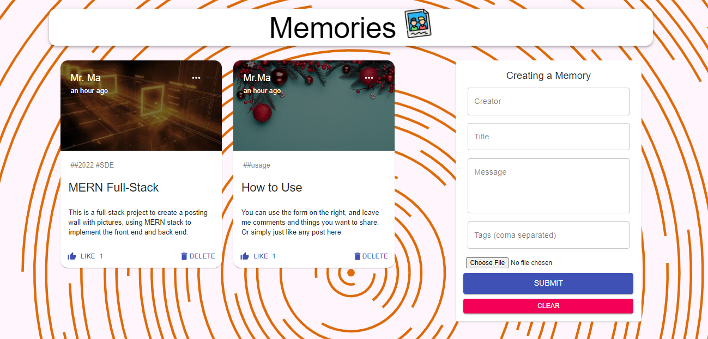

# Mern-Memories
This project is to build and deploy a full-stack app to show memory posts with images, using **MERN Stack** MangoDB, Express.js, React, and Node.js.

Please click [here](https://mern-memoriespost.netlify.app/) to check out this website for more details. 

### Feature :

- Rest APIs to manage data and store data with MongoDB Atlas Database.
- Allow users to post the memory wall with image upload, edit existed posts, and like the posts.
- Allow users to delete unwanted posts from the memories wall.
